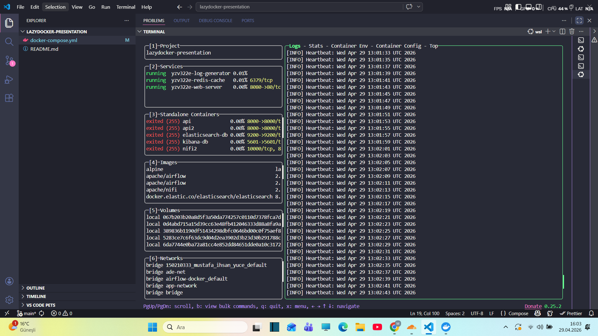

# Lazydocker Presentation - YZV 322E

## 1. What is this tool?
Lazydocker is an open-source terminal UI (TUI) for managing Docker and Docker Compose environments, written in Go. It provides a single-pane dashboard to monitor container logs, view real-time performance stats, and manage images or volumes without memorizing complex CLI flags.

## 2. Prerequisites
To run this project and the tool, ensure you have the following installed:

* **Operating System:** Linux, macOS, or Windows (WSL2 recommended).
* **Docker:** v20.10.0 or higher.
* **Docker Compose:** v2.0.0 or higher.
* **Lazydocker:** See the installation section below.

## 3. Installation
To install Lazydocker on Linux/WSL, use the official installation script:
```bash
curl https://raw.githubusercontent.com/jesseduffield/lazydocker/master/scripts/install_update_linux.sh | bash
```

Note: For macOS users, you can use:
```bash
brew install jesseduffield/lazydocker/lazydocker
```
## Repository Structure
```bash
.
├── README.md
├── docker-compose.yml
└── screenshot.png
```

The `docker-compose.yml` file defines the demo Docker environment used in this project.
## 4. Running the Example
Follow these steps to launch the demo environment and monitor it with Lazydocker:

1. Clone this repository and navigate to the folder:
```bash
git clone https://github.com/itu-itis25-yucem21/lazydocker-presentation.git
cd lazydocker-presentation
```

2. Start the sample containers in detached mode:
```bash
docker compose up -d
```

This project starts three demo services:
- nginx web server
- redis cache
- log generator container

3. Launch the Lazydocker interface:
```bash
lazydocker
```

If the command is not found, run:
```bash
~/.local/bin/lazydocker
```
## 5. Expected Output
Once executed, you should see an interactive terminal interface with the following sections:

* **Containers:** List of running services (`yzv322e-log-generator`, `yzv322e-redis-cache`, `yzv322e-web-server`)
* **Logs:** Real-time log stream of the selected container
* **Stats:** CPU and Memory usage graphs
* **Metadata:** Container status, ports, and details

Expected interface layout:
- Left panel: containers
- Bottom panel: logs
- Right panel: resource usage and metadata


## 6. AI Usage Disclosure
AI tools used:
- Gemini 3 Flash: README drafting, project structure brainstorming, and docker-compose scenario suggestions.

All generated outputs were manually reviewed, tested, and edited by the student.

## Troubleshooting
If Lazydocker is not found in PATH:

```bash
~/.local/bin/lazydocker
```
      
